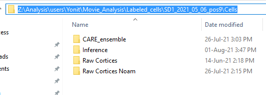
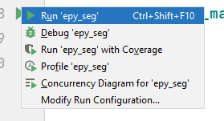
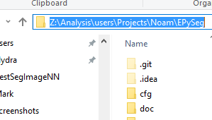
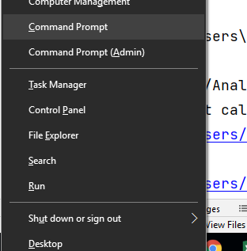

# EPy-Seg (Hydra Implementation)

[EPySeg](https://doi.org/10.1242/dev.194589) is a deep-learning based software for segmenting images 
of epithelial tissue. The [source code](https://github.com/baigouy/EPySeg), 
with documentation, is available online.

EPySeg was developed by the same people as Tissue Analyzer, 
and consistently produces better results for cell segmentation 
in our images than TA, even using just the default parameters 
and model provided as part of the software. 
The data format that is saved from EPySeg is compatible with further 
manual correction and post-processing in TA. 
EPySeg can be run through a GUI, which is very clear and accessible, 
but is then less convenient for running over multiple 
folders or choices of parameters. 
Therefore, we use a script 
(provided by the creator of EPySeg) to run the software directly in python.

Our use of EPySeg can be divided into two main cases:
1. Creating raw segmentation images from CARE outputs 
   (details below) which are used as part of an ensemble of 
   images for inferring a final grayscale image for segmentation.
2. Refined segmentation of the inferred final images
   (binary and skeletonized), which serves as the final 
   segmentation before applying manual corrections or 
   filtering by reliability.
   
The raw segmentation outputs include seven images 
(saved as an image stack named `epyseg_raw_predict.tif`), 
all are independent outputs of the NN. 
These include:
- three watershed-like images differing by the thickness 
of the lines (slices 1-3)
- negatives of thicknesses corresponding 
to slices 2 and 3 (slices 4,5 respectively)
- a positive and negative seed image (slices 6,7) which 
contain a single seed (group of pixels) per cell, 
scaled by cell size and geometry.

The refined segmentation output is a single, binary, 
closed skeletonized image defining cell outlines, 
and saved as a single image called 
`handCorrection.tif` (same as TA output).

## Operation
1. open `cfg/config.yml` in your preferred editor.
   This is a configuration file used to set parameters
   for all scripts.
   search for the `work_dir` variable. Replace the value of `work_dir`
   with the path to your work directory.
   ```yaml
   work_dir: <some path>
   refined_mode: True
   ```
   You can get the path
   from the file explorer by clicking on the box containing
   the parent directories (called breadcrumbs) and copying the result

   

   You also need to choose between using the 'refined' mode
   or the 'raw' mode. You can do that by setting
   `refined_mode` to either `True` (refined) or `False`
   (raw).

2. **Running from PyCharm**:

   Open this folder in PyCharm, and open the file `epy_seg.py`.
   At the very bottom of the file, find the following code fragment:
   ```python
   if __name__ == '__main__':
       main()
   ```
   There should be a 'run' button in the gutter next to it.
   Click on it, and then on `Run 'epy_seg'`:

   

3. **Running from Command Line**:

   Find and copy the path of this directory. You can use the same breadcrumb method like before.

   

   Open command prompt.
   To do so, you can either search for it manually,
   or press `Win+X` then `C`

   

   Then, run
   ```commandline
   Z:
   cd <PATH>
   activate epysegenv
   python epy_seg.py
   ```
   where `<PATH>` is the path to the directory you copied
   earlier.

   

   The script should be running now, with the log visible on command prompt.

## Parameters

## Technical Overview

## Further Work