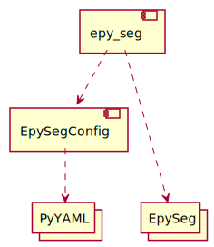

# Segmentation with EPySeg and creating image ensemble

## Contents:

1. Manual for using EPySeg for cell segmentation, both for creating raw segmentation on CARE output for prior to final image inference, and for final segmentation of the final cell images.
2. Manual for arranging, processing, and creating image ensemble in preparation for final image inference.

## 1. EPySeg (Hydra Implementation)

[EPySeg](https://doi.org/10.1242/dev.194589) is a deep-learning based software for segmenting images 
of epithelial tissue. The [source code](https://github.com/baigouy/EPySeg), 
with documentation, is available online.

EPySeg was developed by the same people as Tissue Analyzer.
The library consistently produces better results for cell segmentation 
in our images than TA, even using just the default parameters 
and model bundled in the repository. 
The data format saved from EPySeg is compatible with further 
manual correction and post-processing in TA. 

EPySeg can be run through a GUI, which is very clear and accessible, 
but is then less convenient for running over multiple 
folders or choices of parameters. 
Therefore, we use a script 
(provided by the creator of EPySeg) to run the software directly in python.

Our use of EPySeg can be divided into two main cases:
1. Creating raw segmentation images from CARE outputs 
   (details below) which are used as part of an ensemble of 
   images for inferring a final grayscale image for segmentation.
2. Refined segmentation of the inferred final images
   (binary and skeletonized), which serves as the final 
   segmentation before applying manual corrections or 
   filtering by reliability.
   
The raw segmentation outputs include seven images 
(saved as an image stack named `epyseg_raw_predict.tif`), 
all are independent outputs of the NN. 
These include:
- three watershed-like images differing by the thickness 
of the lines (slices 1-3)
- negatives of thicknesses corresponding 
to slices 2 and 3 (slices 4,5 respectively)
- a positive and negative seed image (slices 6,7) which 
contain a single seed (group of pixels) per cell, 
scaled by cell size and geometry.

The refined segmentation output is a single, binary, 
closed skeletonized image defining cell outlines, 
and saved as a single image called 
`handCorrection.tif` (same as TA output).

### Operation
1. open `cfg/config.yml` in your preferred editor.
   This is a configuration file used to set parameters
   for all scripts.
   search for the `work_dir` variable. Replace the value of `work_dir`
   with the path to your work directory.
   ```yaml
   work_dir: <some path>
   refined_mode: True
   ```
   You can get the path
   from the file explorer by clicking on the box containing
   the parent directories (called breadcrumbs) and copying the result

   

   You also need to choose between using the 'refined' mode
   or the 'raw' mode. You can do that by setting
   `refined_mode` to either `True` (refined) or `False`
   (raw).

2. **Running from PyCharm**:

   Open this folder in PyCharm, and open the file `epy_seg.py`.
   At the very bottom of the file, find the following code fragment:
   ```python
   if __name__ == '__main__':
       main()
   ```
   There should be a 'run' button in the gutter next to it.
   Click on it, and then on `Run 'epy_seg'`:

   

3. **Running from Command Line**:

   Find and copy the path of this directory. You can use the same breadcrumb method like before.

   

   Open command prompt.
   To do so, you can either search for it manually,
   or press `Win+X` then `C`

   

   Then, run
   ```commandline
   Z:
   cd <PATH>
   activate epysegenv
   python epy_seg.py
   ```
   where `<PATH>` is the path to the directory you copied
   earlier.

   

   The script should be running now, with the log visible on command prompt.

### Parameters

All the parameters are stored in `cfg/config.yml`.
We will describe each parameter and its application in this section.

- **work_dir**:

  *type*: `(absolute) path`

  *default*: if not set, all other paths must be absolute.

  The absolute path to the working directory.
  While this does nothing alone, this parameter
  sets a useful anchor for other path parameters.

  You should change this value each time you change a dataset.

- **refined_mode**:

  *type*: `boolean`

  *default*: `False`

  Toggle between 'refined' mode and the 'raw' mode. 
  Set to `True` to use the final (refined) mode.
  Set to `False` to use the raw mode.
  
- **pretraining_model**:

  *type*: `str`

  *default*: None.

  The name of the model to use in EPy-Seg.
  We use `Linknet-vgg16-sigmoid-v2`, but there are other options
  you can view at [epyseg.deeplearning.deepl.EZDeepLearning#pretrained_models_2D_epithelia](https://github.com/baigouy/EPySeg/blob/master/epyseg/deeplearning/deepl.py#L44).
  
- **raw_model**:

  *type*: `path`

  *default*: None.

  the absolute or relative path from the home directory of this python script
  to the model file used to process the data, 
  in particular the first (raw) step that makes many initial guesses for the cell bonds
  are are left for the next step to generate more options, then merge.
  This should stay untouched since the model
  changes very infrequently.

- **refined_model**:

  *type*: `path`

  *default*: None.

  the absolute or relative path from the home directory of this python script
  to the model file used to process the data, 
  in particular the final (or direct) step that makes the final guesses on
  where the tissue bonds lie
  This should stay untouched since the model
  changes very infrequently.

- **raw_input_dir**:

  *type*: `path`

  *default*: None.

  relative path from work directory where the input in raw mode
  (the general output folder of CARE) is placed.
- **refined_input_dir**:

  *type*: `path`

  *default*: None.

  relative path from work directory where the outputs of the 
  final image can be found, used by the refined EPy-Seg.
  If you use the direct parent of the output folder,
  the program will search specifically for directories 
  that do not contain child folders
  and choose the one modified last.
- **ta_output_mode**:

  *type*: `boolean`

  *default*: `True`

  whether to use the parent directory 
  directly or a specific 
  output folder (`{input_folder}/predict`)
  official documentation: 
  > stores as 
  `handCorrection.tif` in the folder with the 
  same name as the parent file without extension.
- **tile_width**:

  *type*: `int`

  *default*: `256`

  the width of the segmentation frame.
- **tile_height**:

  *type*: `int`

  *default*: `256`

  the height of the segmentation frame
- **tile_overlap**:

  *type*: `int`

  *default*: `32`

  the step size (subtracted from tile width or height)
  when moving the segmentation frame
- **misc_args**:

  *type*: `Dict[str,Any]`

  Parameters placed here will be fed directly into epy-seg.
  This allows you to feed arguments
  without changing the config code at all.
  
  Values placed here override the parameters above if
  there is a conflict.
  You can read `cfg/config.yml` for documentation
  of currently used misc. args, but note that
  we are much less aware of their application.

### Technical Overview

The code consists of two classes, each with a single responsibility:
- `epy_seg_config.EpySegConfig` is responsible for
  parsing the configuration file into usable and meaningful python variables.
- `epy_seg.py` runs the EPy-Seg task.
  It is mainly responsible for piping information
  stored in the config class into the `epy_seg` object(s)

Following is a useful graph describing the relationship between
the core libraries of the program:



### Further Work

#### Adding new configurations
To add a new configuration, there are two options:
- You need to feed a special parameter directly
- You want to add a configuration, but process it or use it 
  outside of the EPySeg code.
  
If you are dealing with the former, life is easy:
simply add the parameter name and value in the `misc_args`
section of `cfg/config.yml`:
```yaml
misc_args:
  my_param: my_value
```


However, the latter requires additional cod 
to allow the program,
specifically `EpySegConfig`, to read the corresponding parameter
from `config.yml` and save it within itself.

For example, let's say we want to add a parameter called `my_param`
with a string value.

1. Add it in the actual config file, for example:
   ```yaml
   my_param: my_value
   ```
2. Add the configuration in `EpySegConfig`. To do so,
   add it with a basic value in the `__init__` function:
   ```python
   def __init__():
       self.my_param: str = ''
   ```
3. Link the value in the config into the value in python using
   `EpySegConfig#load()`. This method is responsible for
   reading the yaml file (stored in `raw`) and put it in `self`.

   You will need to add code to copy the value from `raw` to `self`
   (and potentially more context sensitive stuff like append the work_dir path)

   For instance:
   ```python
   def load(rel_path: str):
       ...
       self.my_param = raw['my_param']
   ```

   Finally, you can use `self.to_absolute(work_dir, <PATH>)`
   to convert a path to a path potentially relative to the work directory.
#### Containerization

The main problem with our current codebase
is that different computers have different python environments.
This can cause different bugs on different computers.
The solution to this issue is to use a 'container' - a mini
virtual computer built with exactly the environment we want,
which exists only to perform the task at hand. It has all
the environment ahead of time, so we don't need to spend time
setting up the environment before running the task.

We will use the [Docker Engine](https://docs.docker.com/engine/)
to containerize this component (and the rest of the pipeline).
We will also use GitLab's image service to store a pre-built
environment of the target environment.


## 2. Rearranging segmented image and ensemble preparation

Once EPySeg is run over the multiple folders of CARE output in preparation for the final image inference, a few steps need to be performed, which are all completed using the matlab script **arrangeSegmentedImages.m**.

The processes performed are:
1. Rearranging segmentation images after using EPySeg or TissueAnalyzer.
2. Creating ensemble images (specifically non-linear combinations of images used for final image inference - see final image documentation) after segmentation and rearrangement for final image inference.
3. Post-processing of all ensemble images for final image inference.

### Parameters:
**Notice that each of the three steps performed in the script require parameters to be set.**

```matlab
%% General Parameters:
topDir = 'Z:\Analysis\users\Yonit\Movie_Analysis\Labeled_cells\SD1_2021_05_06_pos9\Cells\CARE_ensemble\'; % Top directory of all images that will be used for inference.
maskDir = 'Z:\Analysis\users\Yonit\Movie_Analysis\Labeled_cells\SD1_2021_05_06_pos9\Display\Masks\'; % Mask directory.

```

```matlab
%% Parameters for rearrnagement:
% When using EPySeg or Tissue Analyzer for automatic segmentation, it
% outputs each segmented image renamed "epyseg_raw_predict.tif" or
% "handCorreation.tif" in a seperate new directory named as the original
% image.
% The following script rearranges these segmented images: it changes each
% image name into its original informative name, removes it from the
% isolated new directory into a new segmentation directory, and deletes the
% directory which was created by EPySeg or Tissue Analyzer.
% Notice: this script deletes directories! It does so only if those dirs
% are empty, but still - be careful and check your input carefully. More
% importantly - this script moves images from one directory to another. All
% images, created by any model, are named the same way (based on their
% original movie), so if one decides to move them all into the same
% directory by mistake, the latest will run over the others.

% carefully change the 2 directories below:
baseDir =  [topDir,'\CARE_output\SS_model_sigma']; % Directories of current segmentation images
NewBaseDir =  [topDir,'\EPySegRawTest\']; % New directory for segmentation images
% Sigma values (or sub-names of folders) for different folders containing the
% segmentation output that you would like to run over.
sigmaVals = {'2_0','2_1','2_2','2_3','2_4','2_5','2_6','2_7','2_8','2_9','3_0'};
% If the segmented images are in the raw epyseg format, set the following
% to 1:
isRawEPySeg = 1; 
% Image planes you would like to save from the EPySeg data (out of 7 - see
% EPySeg manual for details):
planes = [1:7];
```
```matlab
%% Parameters for ensemble creation:
% If you want to create separate ensembles from multiple image sets, list
% all directories from which you want to create ensembles, and give each a
% name. Standard naming is the date and indication of folder from which
% ensemble is created, e.g. '27July_E3' for EPySeg3, '27July_E5' for
% EPySeg5.
% Directories from which to create ensemble :
dirList = {'\EPySegRawTest\3','\EPySegRawTest\5'};
ensembleNameList = {'19Aug_E3','19Aug_E5'}; 
mode = 'all'; %"mean", "var", "std" or "all" (default) - what type of images to save
```
```matlab
%% Parameters for post-processing ensemble images:
% This includes multiplying by the image mask, normalising, and saving as
% 16bit with .tif ending. Notice here that images are manipulated and
% resaved, so original images will not be kept.
resize = 0; % If you want to resize all images, set to desired pixel size (e.g. [1024, 1024];
inverseFlags = {'EPySegRawTest/4','EPySegRawTest/5','EPySegRawTest/7','19Aug_E5'}; % List of directories of inverse (light background) images. 
% This is important so their mask is applied correctly and maintains a
% light background. Make sure to include also folder of ensemble of inverse
% images. 

```
